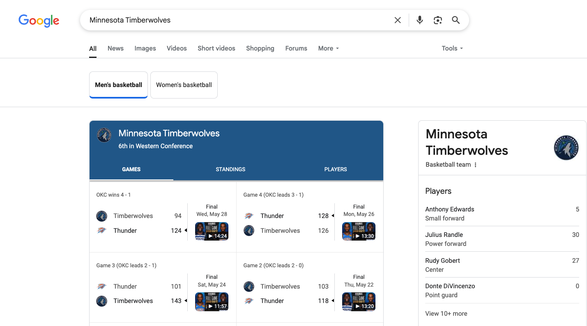
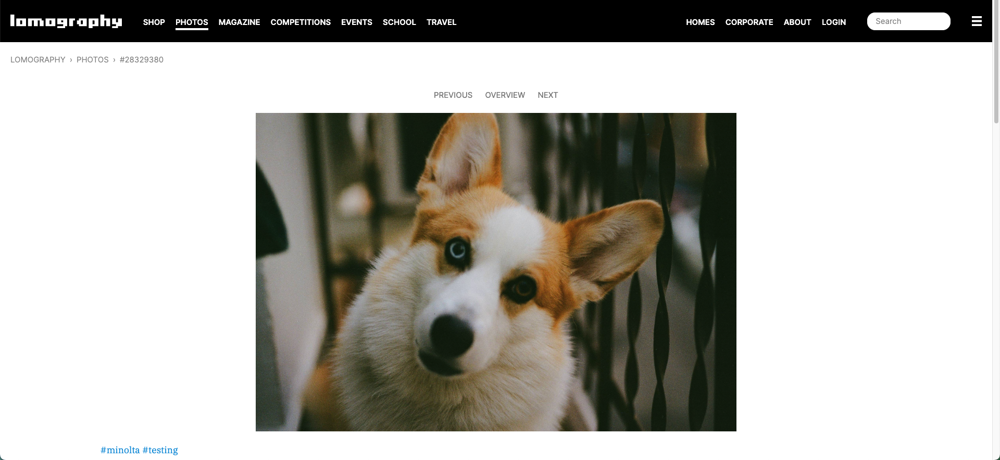
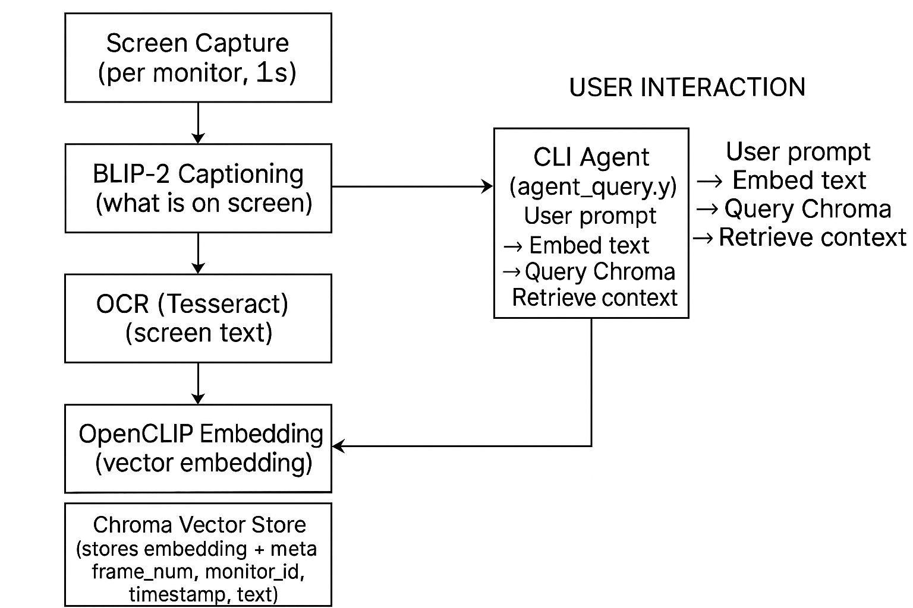

# Overview

Running a local AI agent that is capable of answering questions related to your screen activity.

# Example

```
=== Reasoning Agent CLI ===
Enter a prompt to query your screen history.
Type 'exit' to quit.


Prompt> When did I open Google Search?

=== Agent Response ===
Based on the provided screen context, you opened Google Search at 2025-06-05 11:44:02.


Prompt> What did I search for?

=== Agent Response ===
Based on the provided context, it appears that the user was originally conducting a Google search for something related to Minnesota, as ind
icated by the query "Minnesota" in the URL of the google search page. At some point, the user may have navigated away from this search result
, possibly to initialize a Python GitHub repo or check their email (as suggested by the text on the screen), but eventually returned to the G
oogle search results for Minnesota, specifically focusing on the Minnesota Timberwolves basketball team. This is indicated by the URL of the
google search page which includes "Minnesota+Timberwolves".
```



```
Prompt> When I was browsing a site called "lomography", what type of pictures did I look at?

=== Agent Response ===
Based on the provided screen context, it appears that you were looking at pictures of dogs on a website called "lomography". The images you
viewed had captions stating that the dog was looking at the camera.
```



# Architecture



# Setup

### 0. Install Dependencies

```
brew install tesseract

pip install -r requirements.txt
```

### 1. Start Docker Containers

```
docker-compose up --build
```

### 2. Start Screen Grabber Service

```
PYTHONPATH=src python -m video_feed.screen_capture
```

### 3. Start Reasoning Agent

```
PYTHONPATH=src python -m video_feed.agent_query
```

### X. Additional Commands

Stop the service and take down the data volumes:

```

docker-compose down -v

```

Tail the container logs:

```
docker-compose logs
```
